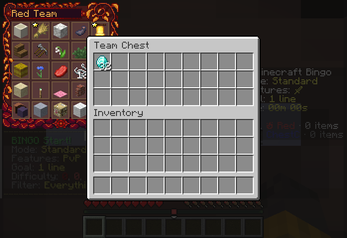
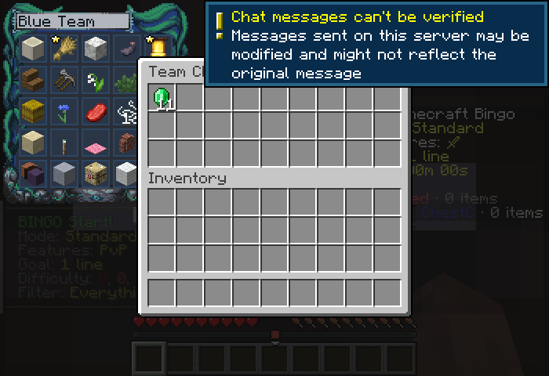
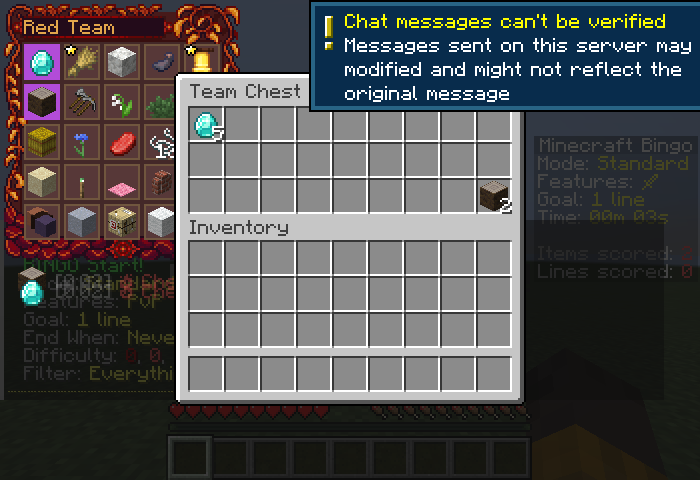
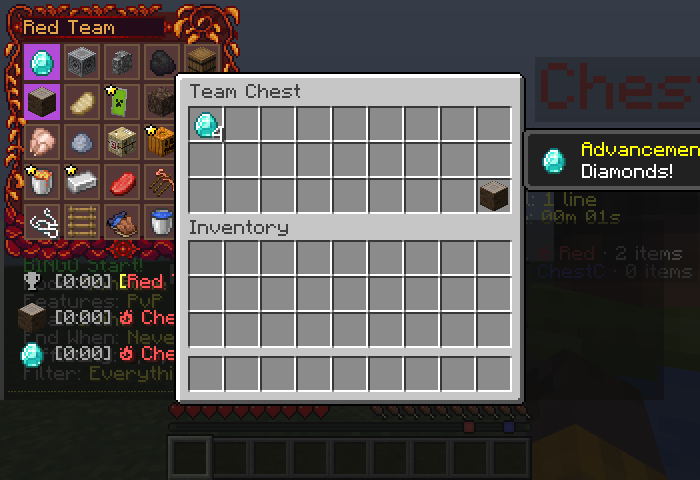

# Minecraft 26.3 验证

验证日期：2026-10-02。Java 25，Minecraft 26.3，Fabric Loader 0.19.5，Fabric API 0.161.0+26.3，Yet Another Bingo 2.14.0。

使用三个独立的真实 Minecraft 客户端（ChestA、ChestB、ChestC），通过本机 TCP 连接测试服务器。首先运行 Fabric 的 DedicatedServer 游戏测试，再用发布 JAR 启动独立服务端进程，验证 Bingo 大厅模式、真实保存重启和三轮游戏。账号是本地离线测试账号。

物品和卡片目标由测试夹具准备；存取操作通过客户端发送正常菜单数据包。计分由 Bingo 的正常 tick 执行，重置通过实际 `/bingo reset` 执行。测试模组和源码不包含在发布 JAR 内。

## 结果

| 场景 | 结果 |
| --- | --- |
| 26.1、26.2、26.3 三个模块构建 | 通过 |
| 单人客户端 25 项回归，B 键、命令别名、配置、序列化和存储重载 | 通过 |
| 两人同队开启同一箱，第三人异队使用独立箱 | 通过 |
| 右键取半组、Shift 存取、同队客户端同步、异队不受影响 | 通过 |
| 两个客户端同时取同一格，总量守恒，关界面后游标物品只返还一次 | 通过 |
| 同队传送、位置与视角、实际客户端位置更新、跨维度传送及别名 | 通过 |
| 自传送、异队、无队伍、未开始、已结束、功能关闭、无目标和控制台限制 | 通过 |
| 非 OP 不能配置；游戏中配置锁定；已打开界面被撤销 OP 后不能操作 | 通过 |
| 配置三个开关，左右键行数循环与边界，UI 装饰物品无法取走 | 通过 |
| 1–6 行实际箱子菜单，两个客户端均收到正确菜单和格数 | 通过 |
| 正常 Bingo 判定：箱内钻石和白杨原木完成 2 项目标，队伍计 2 分且保留物品 | 通过 |
| 关闭箱子计分：箱内目标不计分，玩家背包中的目标仍正常计分 | 通过 |
| 消耗模式：共享目标各消耗一次，同队两人不会重复扣除；异队箱与分数隔离 | 通过 |
| 同队玩家断线重连，箱内内容保持 | 通过 |
| 正常关闭整个服务端 JVM，再启动并重连：队伍、5 个钻石、2 个白杨原木和配置保留 | 通过 |
| 三轮实际 Bingo reset：回到 PREGAME、关闭旧菜单、序列化库存映射为空 | 通过 |
| 发布 JAR 元数据、默认资源及无测试类检查 | 通过 |
| CI 变更检测 11 个场景 | 通过 |
| Modrinth App 中的 Fabric 26.3 实例加载和进入测试世界 | 通过 |

1–6 行菜单检查使用夹具设置配置，以覆盖每种原版菜单类型；正常游戏仍禁止修改配置。

补测发现并修复：在配置界面已经打开的情况下撤销 OP，旧实现仍允许修改配置。26.3 配置菜单现在在处理按钮时重新检查 `COMMANDS_GAMEMASTER`，拒绝并关闭无权操作的界面。三个联网客户端和单人回归均验证了最终实现。

## 截图






## 复现（macOS）

需要 Java 25、网络连接和图形桌面。夹具在忽略的 `build/verification/` 目录创建离线测试服和世界，绑定 `127.0.0.1`。不会使用 Modrinth 的登录凭据或现有世界。

```sh
python3 verification/mc26.3/prepare.py
bash gradlew :mc26.1:build :mc26.2:build :mc26.3:build :mc26.3:dumpVerificationLaunch -I build/verification/client-tests.init.gradle --console=plain
python3 build/verification/run-multiplayer.py
python3 build/verification/run-production.py
python3 build/verification/run-bingo-baseline.py
python3 verification/mc26.3/prepare.py --mode singleplayer
bash gradlew :mc26.3:runClientGameTest -I build/verification/client-tests.init.gradle --console=plain
```

`prepare.py` 获取固定的 Bingo 版本并验证 SHA-512。多人运行器会正常结束测试客户端及服务端；测试目录和日志保留用于复核。测试服脚本在隔离目录写入 `eula=true`。

本次完整日志保存在 `build/verification/multiplayer-20261002-131133/`、`build/verification/production-20261002-132644/`、`build/verification/final-singleplayer.log` 和 `build/verification/bingo-shutdown-baseline/server.log`。

Bingo 在关服时记录 `getScope invoked, but the server scope does not exist!`，大厅模式还可能记录 `Skipping erroneous WorldDeleter call`。移除 Team Chest 和验证模组、仅运行 Bingo 的对照服务器也复现了这两条日志并正常退出（退出码 0）。最终测试服务器和三个客户端均退出为 0；这些日志不计为 Team Chest 的通过项，也未因本次适配而修改 Bingo。

## 发布产物

`YetAnotherBingo-TeamChest-mc26.3-1.3.3.jar`

SHA-256：`c08d315aca20c2a81f3b1fa577db92e13e00c7b8b32dc65480b9b9a6916fe717`

Minecraft：`>=26.3 <26.4`，Loader：`>=0.19.5`，Fabric API：`>=0.161.0+26.3`，Bingo：`>=2.14.0`。
